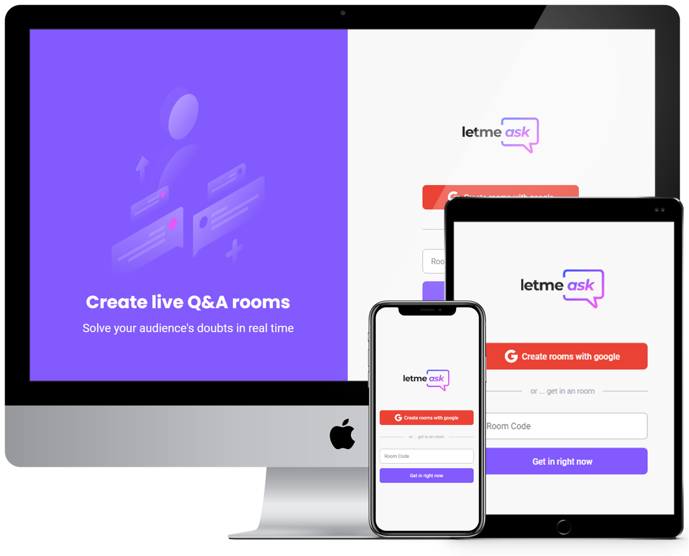

<h1 align="center">
    
</h1>
<br>
<p align="center">
  <a href="#desktop_computer-project"></a>&nbsp;
  <a href="#nail_care-layout"></a>&nbsp;
  <a href="#technologist-technologies"></a>
  <a href="#octocat-environment"></a>&nbsp;
  <a href="#bookmark_tabs-license"></a>&nbsp;
</p>

<p align="center">
 
</p>

<br>
<hr>

## :desktop_computer: Project

<strong>Letmeask</strong> is a Q&A platform that empowers people to share and grow knowledge.

Solve your audience's doubts in real time! 🤭

Application created in [@Rocketseat's](https://github.com/Rocketseat) sixth edition of NextLevelWeek, an online event that occurred on june 20th to 27th, 2021.

In this application it was possible to deepen knowledge in front-end development, reviewing concepts like: 

- SPA (Single-page Application), 
- React-Components,
- React-Props,
- React-Hooks,
- React-Context,
- Immutability,
- SASS,
- React-router-dom (Routing),
- Firebase (Auth),
- Firebase (Realtime Database),
- Firebase (Hosting),

<h3>You can also check: <a href="https://letmeask-lemec.web.app/">Deploy</a></h3>
<br>

## :nail_care: Layout
<p align="center">

</p>
<hr>

## :technologist: Technologies

- [React](https://pt-br.reactjs.org/)
- [Typescript](https://www.typescriptlang.org/)
- [Sass](https://sass-lang.com/)
- [Firebase](https://console.firebase.google.com/)

<br>
<hr>

## :octocat: Environment

Keep in mind that the following installations will be needed:

- [Git](https://git-scm.com/book/pt-br/v2/Come%C3%A7ando-Instalando-o-Git)
- [Yarn](https://classic.yarnpkg.com/en/docs/install/#debian-stable)

>`Alert 1:` Due to some features in the styling, it is not recommended to use IE 6-8 as a browser when using this application. <br>

Follow the instructions to run the application:

1. Clone the repository: 
```bash 
git@github.com:CaioLemec/letmeask-web.git
```
2. Install all dependencies by using command:
```bash
 yarn
 ```
3. In the project root, find and rename [.env.local.exemple](./.env.local.exemple) to `.env.local` following inside instructions.  

```bash
Follow the instructions inside to fill the environment variables.
```
4. At your terminal set this command line to get <strong>dev</strong> mode running:
```bash
yarn dev
```
5. Access the generated address in your browser:
```bash
http://localhost:3000/
```
<hr>

## :bookmark_tabs: License

Licensed under MIT [LICENSE](./LICENSE.md).

<hr>

I am available for any clarification. 
    

<h3>Caio Lemec<h3>
<a href="https://t.me/caiolemec">
<a href="mailto:caiolemec@gmail.com">
<a href="https://www.linkedin.com/in/caiolemec/">
<br>
</p>

